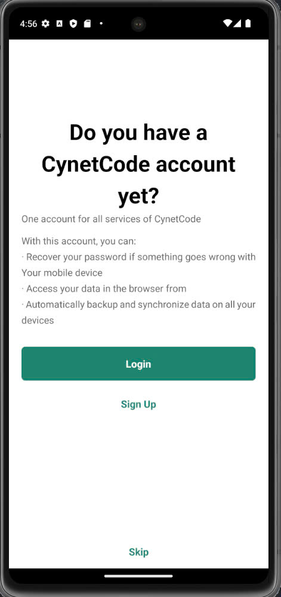
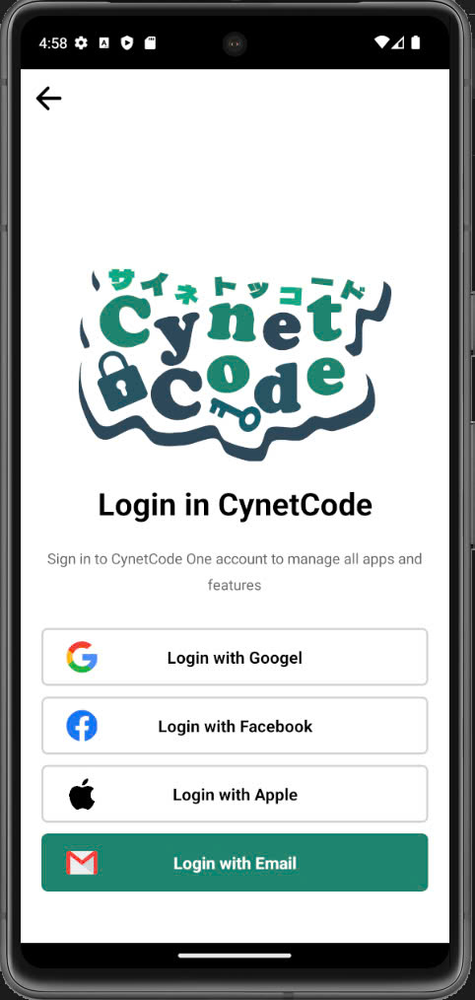
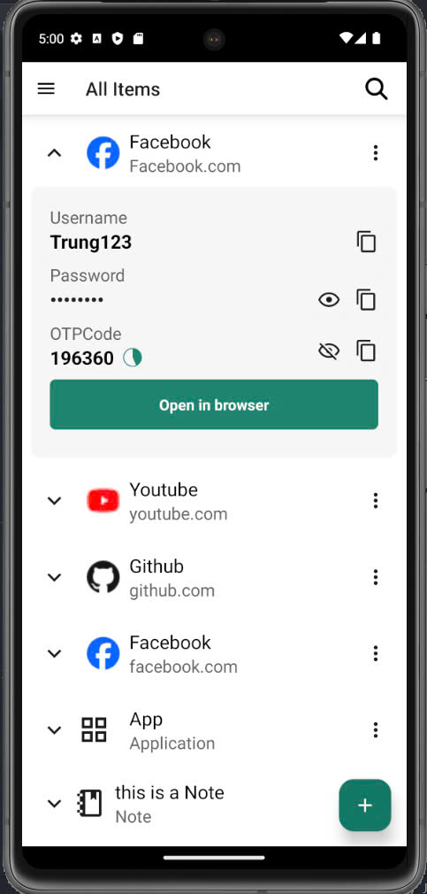
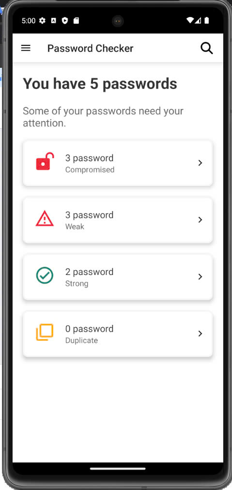
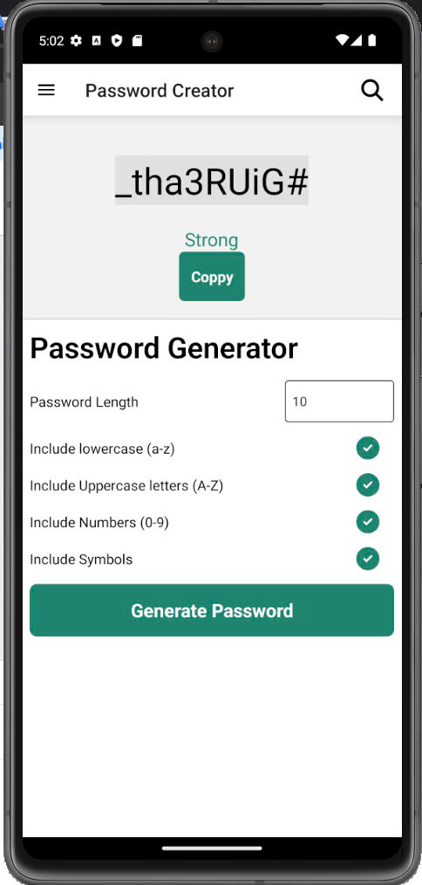

# CynetCode

CynetCode is a password management application developed using **React Native**. It includes **two-factor authentication (2FA)** for enhanced security, allowing users to store and manage their passwords securely. The app provides a seamless and user-friendly interface to help users organize their credentials and protect sensitive data with additional layers of security.

> Below are some screenshots showcasing key features of the CynetCode app:






---
## Features

- **Two-Factor Authentication (2FA)**: Adds an extra layer of security.
- **Password Management**: Securely store and organize passwords.
- **User-friendly Interface**: Intuitive design for ease of use.

## Getting Started

1. Clone the repository:
    ```bash
    git clone https://github.com/JungCode/CynetCode.git
    ```

2. Install dependencies:
    ```bash
    npm install
    ```

3. Run the app:
    ```bash
    react-native run-android
    # or
    react-native run-ios
    ```

## Contributing

Feel free to fork this repository, open issues, and submit pull requests.
